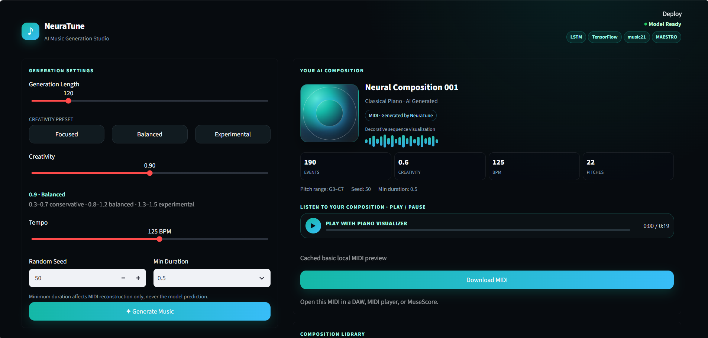
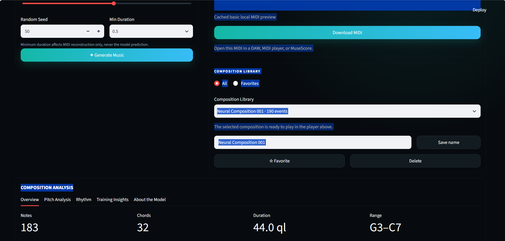
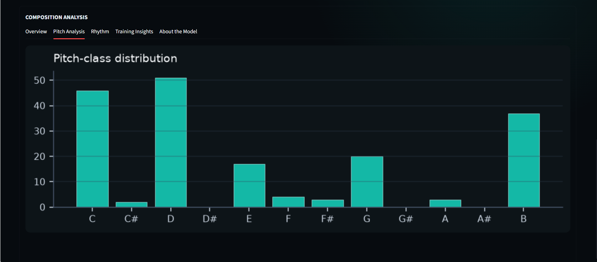
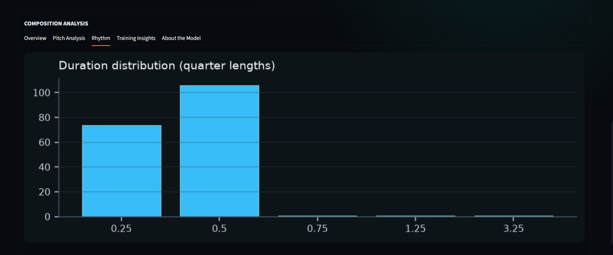

# NeuraTune — AI Music Generation Studio 🎵

NeuraTune is an AI-powered music generation studio developed as **Task 3 of the HorizonTechX Artificial Intelligence Internship**.

It explores how recurrent neural networks can learn musical structure from MIDI data and generate new compositions. The project covers the complete workflow from dataset validation and preprocessing to LSTM-based sequence modeling, autoregressive generation, MIDI reconstruction, high-quality local audio rendering, visualization, evaluation, and an interactive Streamlit studio.

---

## ✨ Features

- AI music generation with TensorFlow / Keras recurrent neural networks
- MAESTRO MIDI dataset discovery and validation
- Iterative model development across V1, V2, V3, V4, and V4E experiments
- Frozen **V4 Production** model used by the Streamlit application
- Onset-grouped polyphonic generation
- Conditional autoregressive pitch decoding with **START / EOS**
- Pitch-conditioned duration prediction
- Learned inter-onset delta timing
- Temperature-based creativity control
- Top-k sampling
- Reproducible generation with random seeds
- Configurable composition length and tempo
- MIDI download
- High-quality local audio rendering through **FluidSynth + SoundFont**
- Built-in lightweight WAV fallback when FluidSynth is unavailable
- Animated Synthesia-style piano visualizer
- Play / Pause / Restart / Minimize / Exit controls
- Audio-synchronized falling notes and active piano keys
- Persistent Composition Library
- Rename, delete, favorite, filter, restore, and replay saved compositions
- Pitch and rhythm analysis
- V4 Production training insights
- Responsive dark music-studio interface
- Deterministic seed-based **Neural Record** artwork
- Subtle composition entrance and ambient artwork animation

---

# 🧠 AI Approach

NeuraTune uses recurrent neural networks because music is sequential: future musical events depend on preceding musical context.

The project intentionally evolved through several representations. Each version was kept because it documents an important modeling lesson.

---

## V1 — Event Tokens

V1 represented each musical event as a single categorical token:

```text
note:C4|duration:0.5
chord:C4.E4.G4|duration:1.0
```

Architecture:

```text
Integer Event IDs
      ↓
Embedding(64)
      ↓
LSTM(64)
      ↓
Dropout(0.2)
      ↓
Dense(vocabulary_size, softmax)
```

Key characteristics:

- 50-event sequences
- 31,668-token vocabulary
- 149,953 training sequences
- ~4.1M parameters

V1 established the end-to-end pipeline but exposed important limitations:

- very large sparse vocabulary
- many rare chord/event tokens
- flattened representation lost detailed timing structure
- weak handling of true polyphony
- vocabulary/output layer dominated the parameter count

---

## V2 — Explicit Musical Attributes

V2 represents each note event as:

```text
[pitch, delta_time, duration]
```

This preserves:

- MIDI pitch
- time since the previous onset
- note duration
- simultaneous-note timing
- piece boundaries

Architecture:

```text
Pitch Embedding(32)
       +
Delta Embedding(16)
       +
Duration Embedding(16)
       ↓
Concatenation
       ↓
LSTM(256)
       ↓
Dropout(0.3)
       ↓
Pitch / Delta / Duration heads
```

Parameters: **392,902**

V2 was a major improvement over V1 and became the first production-capable Streamlit backend. It also revealed a structural limitation: pitch, duration, and timing were predicted through mostly independent heads, which could produce locally plausible but jointly awkward musical combinations.

V2 is now retained as a historical CLI/model version. Existing V2 compositions in the Composition Library remain playable.

---

## V3 — Onset-Grouped Experimental Model

V3 groups simultaneous notes into one onset timestep.

Each timestep contains up to:

- 8 pitch slots
- 8 aligned duration slots
- 1 delta-time value

Input shapes:

```text
Pitch:    (batch, 50, 8)
Duration: (batch, 50, 8)
Delta:    (batch, 50)
```

Architecture:

```text
Pitch Embedding(32)
Duration Embedding(16)
Delta Embedding(16)
        ↓
Per-slot feature combination
        ↓
Onset-group representation
        ↓
LSTM(256)
        ↓
Dropout(0.3)
        ↓
Pitch / Duration / Delta outputs
```

Parameters: **896,297**

V3 proved that onset grouping was the right direction, but the experiment used only a very small subset of source pieces and did not receive a complete production generation pipeline.

V3 remains experimental and is **not integrated into the Streamlit studio**.

---

# ⭐ V4 — Production Model

V4 became the final production representation.

Instead of predicting flattened note events, V4 models music as **groups of notes that begin at the same musical moment**.

Each timestep stores:

- up to 8 simultaneous pitches
- aligned durations for those pitches
- one inter-onset delta value

The preprocessing uses:

- 0.25-quarter-length timing grid
- sequence length of 50 onset groups
- maximum 8 pitches per onset
- deterministic handling of the small number of onset groups exceeding 8 notes
- strict piece boundaries
- explicit PAD handling

Production dataset statistics:

- 50 MAESTRO source pieces
- 120,824 onset groups
- 118,324 total 50-onset sequences
- 88,814 training sequences
- 29,510 validation sequences

Piece split:

```text
Training:   pieces 0–39
Validation: pieces 40–49
```

### V4 Architecture

```text
Pitch Embedding(32)
Duration Embedding(16)
Delta Embedding(16)
        ↓
Historical feature combination
        ↓
LSTM(256)
        ↓
Dropout(0.3)
        ↓
Conditional GRU(256) pitch decoder
        ↓
START → pitch slots → EOS
        ↓
Pitch-conditioned duration prediction

Historical state
        ↓
Separate learned delta-time head
```

Production parameter count:

**969,987**

V4 uses:

- teacher forcing during training
- explicit START token
- explicit EOS termination
- masked pitch/duration losses
- normal unweighted rhythm losses
- early stopping
- best-weight restoration
- learning-rate reduction

The selected frozen production model is:

```text
models/classical_lstm_v4_production.keras
```

with metadata:

```text
models/classical_training_metadata_v4_production.json
```

### Production training result

Best epoch:

```text
9
```

Best validation loss:

```text
4.2052
```

Validation metrics:

- real-pitch accuracy: **17.48%**
- EOS accuracy: **87.67%**
- duration accuracy: **78.30%**
- delta accuracy: **56.98%**

Greedy onset behavior:

- 1 note: 33.06%
- 2 notes: 36.50%
- 3 notes: 12.64%
- 4 notes: 13.46%
- 5 notes: 2.70%
- 6+ notes: 1.64%
- mean notes/onset: 2.216
- EOS termination: 99.92%
- 8-note cap rate: 0.08%

V4 is the model currently used by NeuraTune for all new frontend generations.

---

## V4E — Compact Rhythm Experiment

V4E experimented with compact rhythm buckets in an attempt to reduce duration collapse.

It used rhythm classes such as:

```text
1
2
3
4
5–6
7–8
9–12
13+
```

The experiment improved some compact classification behavior but did not produce a clear enough improvement in generation quality to replace the original unweighted EOS-aware V4 model.

V4E remains experimental and is **not integrated into Streamlit**.

---

# 📚 Dataset

The project uses the **MAESTRO v3.0.0 MIDI dataset from Google Magenta**.

The complete MIDI collection contains:

**1,276 performances**

Raw MIDI files are intentionally excluded from the repository.

Place the dataset under:

```text
data/raw/classical/
```

Example structure:

```text
data/
└── raw/
    └── classical/
        ├── 2004/
        ├── 2006/
        ├── ...
        └── 2018/
```

The repository keeps raw dataset files out of Git.

---

# 🎼 MIDI Preprocessing

The project uses **music21** for MIDI parsing and processing.

The preprocessing pipeline evolved across model versions and includes:

- recursive MIDI discovery
- validation
- note/chord parsing
- pitch extraction
- duration extraction
- onset timing
- quantization
- sequence creation
- metadata generation
- piece-level splitting
- numeric NPZ storage
- JSON mappings
- onset grouping
- aligned pitch-duration slots
- duplicate removal
- PAD handling
- deterministic overflow handling

V4 preserves source-piece boundaries so training windows never cross between different compositions.

---

# 📊 Evaluation and Diagnostics

Generated music is evaluated using both model metrics and musical structure.

Diagnostics include:

- pitch diversity
- pitch range
- onset density
- notes per onset
- inter-onset timing distribution
- duration distribution
- simultaneous notes / polyphony
- repeated melody events
- melodic pitch movement
- one-semitone clashes
- generated span
- EOS termination
- onset-cap behavior

Additional dataset diagnostics are provided by:

```text
src/analyze_training_music.py
```

This tool measures:

- onset-size distribution
- timing behavior
- duration distribution
- pitch/register distribution
- highest-pitch melody proxy
- repetition
- large melodic movement
- simultaneous intervals

A major project lesson was that **loss and accuracy alone do not determine musical quality**. Listening tests and structural MIDI analysis were therefore used together.

---

# 🖼️ Application Screenshots

Selected screenshots are stored in the root-level `assets/` folder.

## NeuraTune Overview



Main studio interface with generation controls, model status, and composition workspace.

## AI Composition & Player



Generated-composition view with metrics, high-quality audio preview, MIDI download, and composition metadata.

## Pitch Analysis



Pitch-class distribution for the selected composition.

## Rhythm Analysis



Generated duration distribution and rhythm analysis.

> Screenshots can be refreshed as the interface evolves. The current UI includes V4 Production labels, deterministic Neural Record artwork, Composition Library support, and the animated piano visualizer.

---

# 🖥️ Streamlit Application

The final NeuraTune application uses **V4 Production** for new generation.

Application flow:

```text
Streamlit UI
     ↓
Frozen V4 Production Model
     ↓
50-onset musical context
     ↓
Conditional START/EOS pitch decoding
     ↓
Aligned duration prediction
     ↓
Learned delta timing
     ↓
Grouped polyphonic MIDI reconstruction
     ↓
Authoritative generated MIDI
     ↓
FluidSynth + SoundFont
     ↓
High-quality local WAV preview
     ↓
Piano Visualizer
     ↓
Pitch / Rhythm Analysis
     ↓
Composition Library
     ↓
MIDI Download
```

Generation controls:

- Composition Length
- Creativity
- Focused / Balanced / Experimental presets
- Tempo
- Random Seed

Technical production defaults:

```text
Pitch top-k:          10
Delta temperature:   0.8
Duration temperature:0.8
Max pitches/onset:   8
```

Creativity presets:

```text
Focused       0.8
Balanced      1.0
Experimental  1.1
```

The application caches the frozen V4 model with Streamlit resource caching so the TensorFlow checkpoint is not reloaded for every interaction.

---

# 🎨 Interface Design

NeuraTune uses a compact dark teal/cyan studio interface.

Recent UI refinements include:

- separate **For your next composition** generation settings
- clear **Selected composition** metadata
- deterministic composition artwork derived from the saved seed
- subtle Neural Record groove/orbit animation
- 500 ms composition entrance transition
- seed-stable visual identity
- responsive composition layout
- responsive header and badges
- reduced-motion accessibility handling
- Composition Library integration
- persistent selected-composition metadata
- dedicated high-quality preview status

The Neural Record artwork is decorative and deterministic. It does not affect generation or audio.

---

# 🎧 Audio Preview

NeuraTune supports two local rendering paths.

## High-quality rendering

Preferred:

```text
MIDI
  ↓
FluidSynth
  ↓
SoundFont (.sf2 / .sf3)
  ↓
44.1 kHz rendered WAV
  ↓
NeuraTune player
```

The project currently supports:

```text
FLUIDSYNTH_PATH
NEURATUNE_SOUNDFONT
```

with fallback support for:

```text
SOUNDFONT_PATH
```

Example Windows configuration:

```powershell
setx FLUIDSYNTH_PATH "C:\path\to\fluidsynth.exe"
setx NEURATUNE_SOUNDFONT "C:\SoundFonts\MuseScore_General.sf2"
```

Restart the terminal/editor after using `setx`.

The application will report:

```text
High-quality SoundFont preview
```

when FluidSynth rendering is active.

## Basic fallback

If FluidSynth or a valid SoundFont is unavailable, NeuraTune falls back to its lightweight local synthesizer.

Fallback output is:

- mono
- 22,050 Hz
- 16-bit PCM
- intended as a functional preview rather than a realistic piano renderer

The application reports:

```text
Basic local MIDI preview
```

when this renderer is active.

Preview rendering is **read-only** with respect to the generated MIDI. The V4-generated MIDI is treated as the authoritative composition and is not rewritten for audio playback.

---

# 🎹 Piano Visualizer

Starting playback opens a centered Synthesia-style Piano Visualizer.

Features include:

- real MIDI pitches
- real MIDI offsets
- real note durations
- falling note bars
- dynamic keyboard range
- active-key highlighting
- correct simultaneous-note visualization
- separate lanes for overlapping/retriggered notes on the same pitch
- Play / Pause
- Restart
- elapsed / total time
- progress bar
- Exit
- Minimize
- floating circular minimized player
- progress ring
- playback-state icon
- audio synchronization
- visualization-only fallback if browser audio is blocked

The visualizer uses the browser audio playback clock and `requestAnimationFrame`, so it does not require Python calls for every animation frame.

---

# 📚 Composition Library

Generated compositions are persisted locally in:

```text
outputs/history.json
```

The library supports:

- recent composition history
- selected-composition restoration
- rename
- delete
- favorite / unfavorite
- All / Favorites filtering
- MIDI download
- audio preview
- analysis
- restoring older V2 compositions

New compositions record:

```text
model_version = "V4 Production"
```

The current implementation keeps the ten most recent valid entries.

---

# 📈 Analysis

## Overview

Selected-MIDI metrics such as:

- notes
- chords
- duration
- pitch range

## Pitch Analysis

Pitch-class distribution of the selected MIDI.

## Rhythm

Duration distribution in quarter lengths.

## Training Insights

Production metadata including:

- dataset source
- source MIDI files
- musical events
- training / validation sequences
- output classes
- sequence length
- parameter count
- architecture
- training history when available

Training Insights read from:

```text
models/classical_training_metadata_v4_production.json
```

and the original V4 preprocessing metadata.

## About the Model

The active pipeline is summarized as:

```text
MAESTRO MIDI
→ 50-onset context
→ LSTM historical encoder
→ conditional GRU pitch decoder
→ START/EOS onset construction
→ pitch-conditioned durations
→ learned delta timing
→ MIDI
```

---

# 📁 Project Structure

```text
Horizon-TechX-Music-generation-Using-Ai/
│
├── app.py
├── README.md
├── FEATURES.md
├── requirements.txt
├── .gitignore
│
├── assets/
│   ├── overview.png
│   ├── overview2.png
│   ├── pitchanalysis.png
│   └── rhythm.png
│
├── data/
│   ├── raw/
│   │   └── classical/
│   └── processed/
│       ├── classical_preprocessed.json
│       ├── classical_sequences.npz
│       ├── classical_v2_metadata.json
│       ├── classical_v2_sequences.npz
│       ├── classical_v3_metadata.json
│       ├── classical_v3_sequences.npz
│       ├── classical_v4_metadata.json
│       ├── classical_v4_sequences.npz
│       └── ...
│
├── models/
│   ├── classical_lstm.keras
│   ├── classical_training_metadata.json
│   ├── classical_lstm_v2.keras
│   ├── classical_training_metadata_v2.json
│   ├── classical_lstm_v3.keras
│   ├── classical_training_metadata_v3.json
│   ├── classical_lstm_v4.keras
│   ├── classical_lstm_v4_production.keras
│   ├── classical_training_metadata_v4_production.json
│   └── ...
│
├── outputs/
│   ├── history.json
│   ├── previews/
│   └── neuraltune_v4_*.mid
│
└── src/
    ├── dataset.py
    ├── preprocess.py
    ├── model.py
    ├── train.py
    ├── generate.py
    ├── evaluate.py
    ├── preprocess_v2.py
    ├── model_v2.py
    ├── train_v2.py
    ├── generate_v2.py
    ├── preprocess_v3.py
    ├── model_v3.py
    ├── train_v3.py
    ├── preprocess_v4.py
    ├── model_v4.py
    ├── train_v4.py
    ├── generate_v4.py
    ├── preprocess_v4e.py
    ├── model_v4e.py
    ├── train_v4e.py
    ├── generate_v4e.py
    ├── analyze_training_music.py
    └── audio_preview.py
```

---

# 🛠️ Technologies

- Python
- TensorFlow / Keras
- music21
- NumPy
- Matplotlib
- Streamlit
- MIDI
- LSTM / RNN
- GRU
- FluidSynth
- SoundFont
- HTML / CSS / JavaScript

---

# 🚀 Installation

Create and activate a virtual environment:

```powershell
python -m venv .venv
.\.venv\Scripts\Activate.ps1
```

Install dependencies:

```powershell
pip install -r requirements.txt
```

---

# ▶️ Run NeuraTune

From the project root:

```powershell
.\.venv\Scripts\Activate.ps1
streamlit run app.py
```

Then open the local URL provided by Streamlit, typically:

```text
http://localhost:8501
```

The studio loads existing production artifacts. Normal application use does **not** preprocess or retrain the model.

---

# 🧪 Dataset Validation

```powershell
python -m src.dataset --genre classical --limit 50
```

---

# 🔄 Preprocessing

## V1

```powershell
python -m src.preprocess --genre classical --limit 50 --sequence-length 50
```

## V2

```powershell
python -m src.preprocess_v2 --genre classical --limit 50 --sequence-length 50
```

## V3

```powershell
python -m src.preprocess_v3 --genre classical --limit 50 --sequence-length 50
```

## V4

Use the dedicated V4 preprocessing pipeline when reproducing the V4 training artifacts:

```powershell
python -m src.preprocess_v4 --genre classical --limit 50 --sequence-length 50
```

---

# 🏋️ Training

## V1

```powershell
python -m src.train --genre classical --epochs 5 --batch-size 64
```

## V2

```powershell
python -m src.train_v2 --genre classical --epochs 15 --batch-size 128
```

## V3

```powershell
python -m src.train_v3 --genre classical --epochs 15 --batch-size 128
```

## V4

The checked-in production application uses the already-trained frozen production checkpoint.

If reproducing V4 training:

```powershell
python -m src.train_v4 --genre classical --epochs 20 --batch-size 128
```

Do not overwrite the frozen production checkpoint unless intentionally reproducing and validating the model.

---

# 🎵 V4 Production Generation

Example CLI generation using the frozen production checkpoint:

```powershell
python -m src.generate_v4 \
  --genre classical \
  --length 200 \
  --temperature 1.0 \
  --top-k 10 \
  --delta-temperature 0.8 \
  --duration-temperature 0.8 \
  --seed 42 \
  --tempo 100 \
  --model-path models/classical_lstm_v4_production.keras \
  --training-metadata-path models/classical_training_metadata_v4_production.json
```

PowerShell can also run this command on one line.

Generated MIDI files are saved under:

```text
outputs/
```

---

# ⚠️ Limitations

NeuraTune is an educational / internship project rather than a production commercial music-generation system.

Current limitations include:

- generated quality varies between seeds
- repetition can still occur
- long-term musical structure remains limited
- some unusual harmonic/rhythmic combinations are possible
- duration prediction remains biased toward shorter rhythmic values
- training uses a relatively small 50-piece V4 subset
- production work is currently focused on classical piano MIDI
- dynamics/velocity/pedal information are not modeled as deeply as pitch/timing
- FluidSynth playback quality depends on the configured SoundFont
- the lightweight fallback synthesizer is intentionally simple
- the Composition Library stores a limited recent history
- there is no authentication/database/cloud generation API
- no model-switching UI is exposed to normal users

---

# 🔮 Future Improvements

Potential future extensions include:

- larger MAESTRO training subset
- jazz and additional genres
- Transformer-based sequence modeling
- longer musical context
- richer dynamics / velocity modeling
- pedal and articulation modeling
- explicit rest representation
- richer harmonic conditioning
- instrument-aware generation
- multi-instrument composition
- improved long-term phrase structure
- larger-scale human listening evaluation
- cloud deployment with managed audio rendering

---

# 🧠 Key Development Lessons

1. **Representation matters.**  
   V1's giant token vocabulary made learning inefficient.

2. **Timing matters.**  
   Explicit delta timing significantly improves rhythm representation.

3. **Polyphony needs structure.**  
   Treating simultaneous notes as onset groups is more natural than flattening them into unrelated events.

4. **Joint dependencies matter.**  
   Predicting pitch, duration, and timing independently can produce locally plausible but globally awkward music.

5. **Termination must be modeled explicitly.**  
   V4's START/EOS decoder solved the onset-slot stopping problem.

6. **Sampling matters.**  
   Temperature and top-k strongly affect diversity, repetition, and stability.

7. **Class weighting can improve validation but harm generation.**  
   Better classification metrics do not automatically mean better sampled music.

8. **Perceptual evaluation is essential.**  
   Listening tests revealed problems that aggregate metrics could not capture.

9. **Audio rendering is separate from generation quality.**  
   The same V4 MIDI sounded significantly better through FluidSynth + a sampled SoundFont than through a simple sine-wave fallback.

10. **Production integration matters.**  
    Model quality alone is not enough; history, visualization, playback, reproducibility, analysis, caching, and clear UI state all matter.

---

# 🏁 Project Status

**HorizonTechX Internship — Task 3: Completed**

Final NeuraTune workflow:

```text
MAESTRO MIDI Dataset
        ↓
Validation & preprocessing
        ↓
V4 onset-group representation
        ↓
Frozen LSTM + conditional GRU model
        ↓
START/EOS autoregressive generation
        ↓
Pitch-conditioned durations + learned timing
        ↓
Polyphonic MIDI reconstruction
        ↓
FluidSynth + SoundFont audio preview
        ↓
Animated Piano Visualizer
        ↓
Pitch / Rhythm Analysis
        ↓
Composition Library
        ↓
MIDI Download
```

The active Streamlit studio uses the frozen **V4 Production** checkpoint.

---

# 🙏 Dataset Attribution

This project uses the **MAESTRO v3.0.0 MIDI dataset from Google Magenta** for educational and research purposes.

Obtain and use the dataset according to its official license and terms.

Raw MAESTRO MIDI files are intentionally excluded from this repository.

---

# 👨‍💻 Internship Project

Developed as part of the **Artificial Intelligence Internship at HorizonTechX**.

**Project:** NeuraTune — AI Music Generation Studio  
**Task:** Music Generation Using AI  
**Core technologies:** Python, TensorFlow/Keras, LSTM, GRU, music21, NumPy, Streamlit, MIDI, FluidSynth, SoundFont, HTML/CSS/JavaScript
